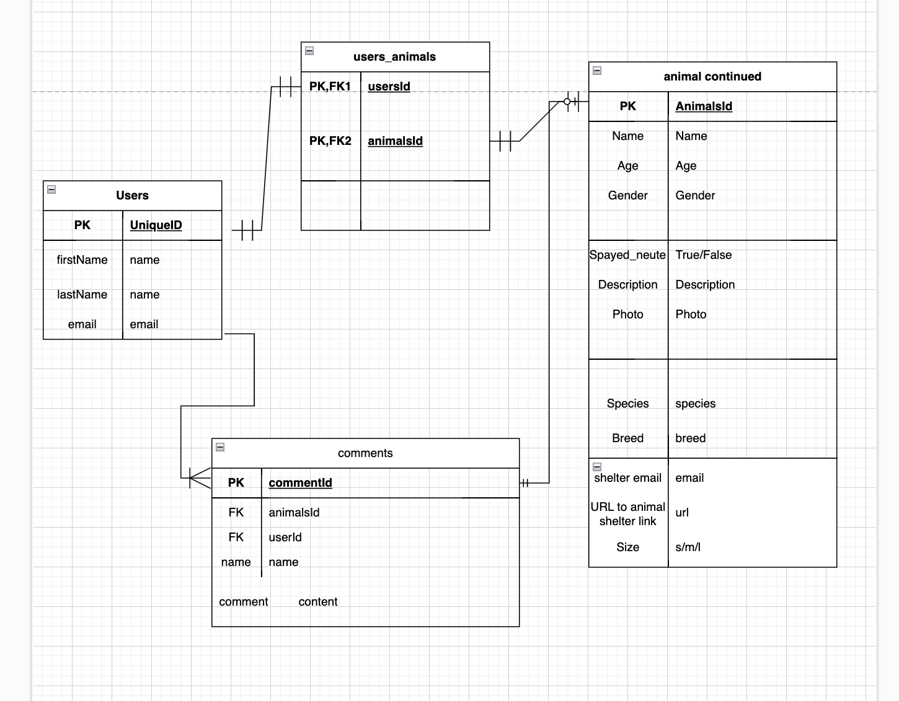

## PET ADOPTION APP 

## Description
I love animals and I always have, (dogs and wolves hold a special place in my heart) and when I was a kid all I ever wanted was a dog. As i grew older I started looking into dogs of my own and was looking at adopting a dog. Most animal service centres are either run by the government or are non-profit organzations which don't leave them with much money for software and technology. My app will make adopting a pet much easier.

# User Stories
A. As a potential adopter, I want to be able to pull up a list of all dogs in my local area and view them 
B. As a potential adopter, I want the ability to see details on certain dogs I click on
C. As a potenitial adopter, I want the ability to add dogs that I am interested in to my favorites list 
D. As a potential adopeter, I want to see comments about the dog from other people who have looked into them

## Choice of API
1. Petfinder API powered by Purina: https://www.petfinder.com/developers/
Basecall: GET https://api.petfinder.com/v2/animals

POC:

## ERDs

## RESTful routes

## WIREFRAMES

## MVP GOALS
- User can sign up for an account using email and password
- User can update sign in information if needed
- User can search for what kind of pet they are looking to adopt and get information back
- User can save any animals they are interested in favorites
- User can comment on a given animal 

## Stretch Goals
- Include ability to be able to directly contact shelter from website instead of just giving contact information
- Include some kind of teleconferincing service within the app so you can have a teleconference with your potential adoptive pet if you are far away 
- Include a page where you can donate to shelters
- I would like to make it more of a social experience so the dog's, cats and what have you get the chance to shine and so do the shelters